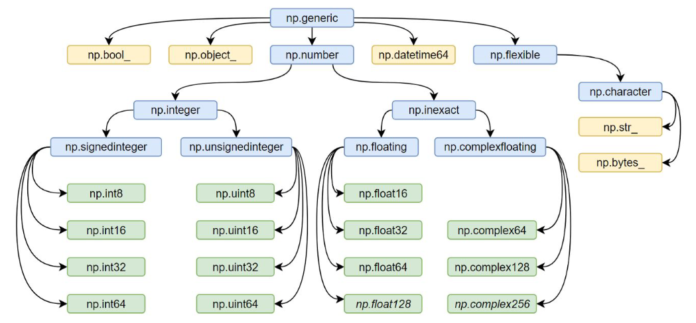
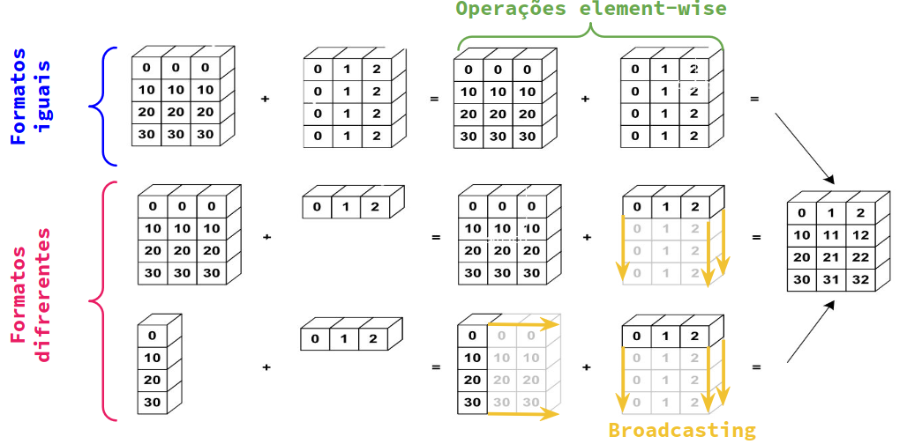

# **Numpy (Numerical Python)**

O Numpy é uma biblioteca Open Source em Python que é largamente utilizada em quase todos os campos da ciência e engenharia.

Sem dúvidas, ela é utilizada o padrão universal para se trabalhar com dados  numéricos em Python, sendo considerada o **CORE** do ecossistema PyData (bibliotecas e ferramentas da comunidade de Data Science em Python). Dito isso, ela é considerada a biblioteca mãe das demais, como Pandas, Scipy, entre outras.

Com ela, é possível:

* Manipular arrays multidimensionais;
* Realizar inúmeras operações matemáticas sobre estes arrays;

## **Tipos de Dados**

O Numpy suporta diversos tipos de dados, os quais são apresentados na imagem abaixo:

</img>

## **Como funcionam as operações entre os ndarrays?**

O Numpy facilita, e muito, a realização de operações entre arrays. No caso, quando utiliza-se do operador "+", por exemplo, isso pode ocorrer elemento a elemento ou, quando o formato dos arrays é diferente, realiza-se o broadcasting. A imagem abaixo ilustra essa situação:

</img>

## **Aplicação**

Nessa seção, será descrito alguns comandos e formas de se utilizar o Numpy.

### **Instalação**

Para realizar a sua instalação no sistema, pode-se utilizar o gerenciador de pacotes do Python, o **pip**:

```shell
pip install numpy
```

### **Importando**

Ao importar o numpy, criamos um apelido para ele, o **np**.

```python
import numpy as np
```

### **Criando um numpy array**

Todos os arrays do numpy são do tipo **ndarray**. Seu nome se da pela ideia de "n dimensions array", ou seja, um array com várias dimensões possíveis. 

### **One dimentional array**

Code:

```python
arr = np.array([1,2,3])
print(arr)
```

Output:

```console
[1,2,3]
```

### **Two dimentional array**

Code:

```python
arr = np.array([
        [1,2,3,4],
        [5,6,7,8],
        [9,10,11,12]
    ])
print(arr)
```

Output:

```console
[[1,2,3,4]
 [5,6,7,8]
 [9,10,11,12]]
```

### **Slicing**

Slicing the array in order to get 3,4,7 and 8 elements. The second element (end) is exclusive.

Code:

```python
print(arr[:2,2:])
```

Output:

```console
[[3 4]
 [7 8]]
```

### **Creating an array of zeros**

One dimentional array with 10 zeros.

Code:

```python
arr = np.zeros(10)
print(arr)
```

Output:

```console
[0. 0. 0. 0. 0. 0. 0. 0. 0. 0.]
```

### **Creating an array of ones**

Two dimentional array with ones (3 rows and 3 colums).

Code:

```python
arr = np.ones((3,3))
print(arr)
```

Output:

```console
[[1. 1. 1.]
 [1. 1. 1.]
 [1. 1. 1.]]
```

### **Creating an array with arange**

Code:

```python
arr = np.arange(start=1, stop=13, step=1)
print(arr)
```

Output:

```console
[ 1  2  3  4  5  6  7  8  9 10 11 12]
```

### **Reshaping an array**

In this case, the array should be compatible with desired shape.

Code:

```python
arr = np.arange(start=1, stop=13, step=1).reshape((3,4))
print(arr)
```

Output:

```console
[[ 1  2  3  4]
 [ 5  6  7  8]
 [ 9 10 11 12]]
```

### **Creating an array with linearly spaced**

Code:

```python
arr = np.linspace(start=0, stop=100, num=11)
print(arr)
```

Output:

```console
[  0.  10.  20.  30.  40.  50.  60.  70.  80.  90. 100.]
```

### **Concatenating arrays**

Code:

```python
arr1 = np.array([1,2,3,4])
arr2 = np.array([5,6,7,8])
print(np.concatenate((arr1,arr2)))
```

Output:

```console
[1 2 3 4 5 6 7 8]
```

### **Attributes of array**

Code:

```python
arr = np.array([
        [1,2,3,4],
        [5,6,7,8],
        [9,10,11,12]
    ])
print(arr.size)
print(arr.ndim)
print(arr.shape)
```

Output:

```console
12
2
(3, 4)
```