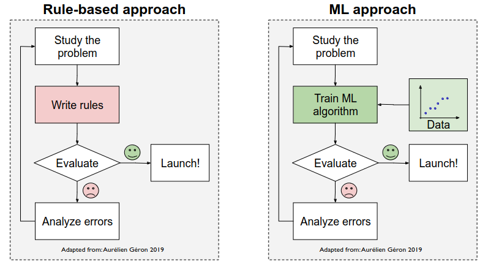

# **Aprendizado de Máquina**

Aprendizado de máquina (em inglês, "machine learning") é uma técnica de inteligência artificial que permite que as máquinas aprendam a partir de dados sem serem explicitamente programadas. Em vez de seguir uma programação específica, os algoritmos de aprendizado de máquina usam modelos matemáticos e estatísticos para aprender a partir de exemplos e dados.

O objetivo do aprendizado de máquina é desenvolver modelos que possam prever resultados futuros ou tomar decisões com base em dados históricos. Esses modelos são treinados usando conjuntos de dados de treinamento, que consistem em exemplos rotulados com resultados conhecidos, para que possam aprender a fazer previsões precisas em novos conjuntos de dados. O aprendizado de máquina é usado em muitas áreas, incluindo reconhecimento de fala, visão computacional, processamento de linguagem natural, sistemas de recomendação e análise preditiva.

## **Algoritmos baseados em regras x Aprendizado de Máquina**
</img>

## **Aplicações**

O aprendizado de máquina é muito utilizado para:

*   Problemas que a solução requer muitas regras ou ajuste manual de parâmetros;
*   Problemas complexos, os quais não possuem solução algorítimica ou essa solução é muito complexa;
*   Ambientes flutuantes, os quais o algoritmo precisa ser atualizado constantemente;
*   Obter percepções sobre problemas complexas, em que há grandes quantidades de dados;

## **Principais problemas solucionados pelo Aprendizado de Máquina**

*   **Problemas de Classificação:** Modelo de ML especifica/classífica um determinado dado para uma classe específica.
*   **Problemas de Regressão:** Modelo de ML, o qual prevê um valor de saída dado um valor de entrada.
*   **Problemas de Agrupamento:** Modelo de ML, o qual agrupa os dados do conjunto baseado na similiaridade entre eles.

---

## **Tipos de Aprendizados quanto a Supervisão**

### **Aprendizado Supervisionado**

O aprendizado supervisionado é uma das principais categorias de técnicas de aprendizado de máquina. Ele envolve a utilização de um conjunto de dados de treinamento que contém exemplos rotulados para treinar um modelo a fim de que ele possa prever ou classificar novos dados.

No aprendizado supervisionado, o objetivo é aprender uma função de mapeamento entre as entradas e as saídas, de modo que o modelo possa generalizar a partir dos exemplos de treinamento e prever ou classificar novos exemplos não vistos anteriormente.

O processo de treinamento do modelo envolve a apresentação de exemplos rotulados ao modelo, que ajusta seus parâmetros de acordo com os dados de treinamento, a fim de minimizar a diferença entre as saídas previstas e as saídas reais.

Algumas das técnicas mais comuns de aprendizado supervisionado incluem modelos de **regressão**, que tentam prever um valor numérico com base nas características de entrada, e modelos de **classificação**, que tentam classificar exemplos em categorias pré-definidas com base nas características de entrada.

Um problema de classificação de email pode ser resolvido através de um modelo de ML treinado de maneira supervisionada, ou seja, seus dados são rotulados.

</img>

**Exemplos de algoritmos de aprendizado supervisionado:** k-Nearest Neighbors, Linear Regression, Polynomial Regression, Logistic Regression, Support Vector Machines(SVMs), Decision Trees e Random Forests, Neural Networks.

### **Aprendizado Não-Supervisionado**

O aprendizado não supervisionado é uma técnica de aprendizado de máquina em que o modelo é treinado com dados não rotulados, sem nenhuma informação prévia sobre as classes ou rótulos dos dados. O objetivo é descobrir padrões ou estruturas ocultas nos dados, como agrupamentos ou clusters, distribuições de probabilidade, relações entre as variáveis e outros insights que possam ajudar a compreender melhor os dados.

Ao contrário do aprendizado supervisionado, em que os dados de treinamento são rotulados e usados para prever as saídas correspondentes para novos dados, o aprendizado não supervisionado trabalha com dados não rotulados e o objetivo é explorar os padrões e estruturas que existem nos dados.

Algumas das técnicas de aprendizado não supervisionado mais comuns incluem:

*   **Clusterização:** uma técnica que agrupa os dados em conjuntos, ou clusters, com base em sua similaridade.

*   **Redução de dimensionalidade:** uma técnica que tenta reduzir a quantidade de recursos necessários para descrever os dados, sem perder muita informação.

*   **Análise de componentes principais (PCA):** uma técnica que tenta encontrar as principais direções de variação dos dados, permitindo reduzir a dimensionalidade dos dados.

*   **Algoritmos de associação:** uma técnica que tenta encontrar padrões e relações entre os itens em um conjunto de dados, como compras em um supermercado.

O aprendizado não supervisionado é usado em muitas aplicações, como análise de mercado, segmentação de clientes, detecção de fraudes, análise de imagens e outras tarefas em que é necessário explorar e descobrir padrões nos dados. Para que isso fique claro, imagine um problema de análise de clientes, os quais fazem pedidos em uma pizzaria e desejamos criar uma filial baseada nos endereços das pessoas, as quais realizam pedidos.

</img>

### **Aprendizado Semi-Supervisionado**

O aprendizado semi-supervisionado é uma técnica de aprendizado de máquina que combina elementos do aprendizado supervisionado e do aprendizado não supervisionado. Ele é utilizado quando se tem um conjunto de dados grande, onde apenas uma pequena parte dele é rotulada, mas o conhecimento prévio disponível sugere que os exemplos não rotulados podem fornecer informações úteis para a modelagem.

Nesse caso, o objetivo é utilizar tanto os dados rotulados quanto os não rotulados para treinar um modelo mais preciso e geral. A ideia é que o modelo possa utilizar a informação contida nos dados não rotulados para generalizar melhor, ou seja, aprender regras que se apliquem a novos dados.

A combinação de dados rotulados e não rotulados é geralmente feita por meio de um algoritmo de aprendizado semi-supervisionado, que utiliza as informações disponíveis para ajustar o modelo. Esse tipo de técnica é especialmente útil em casos em que a rotulagem manual é cara ou inviável.

Algumas das técnicas mais comuns de aprendizado semi-supervisionado incluem modelos baseados em grafos, redes neurais autoencoder, e algoritmos de co-training.

O aprendizado semi-supervisionado é usado em muitas aplicações, incluindo reconhecimento de fala, detecção de spam, classificação de imagens e outros problemas em que se tem muitos dados, mas poucos rótulos disponíveis.

### **Aprendizado por Reforço**

O aprendizado por reforço é uma técnica de aprendizado de máquina que se baseia em uma abordagem de tentativa e erro para maximizar uma recompensa numérica. O objetivo é aprender uma política, que é uma função que mapeia estados para ações, de modo que o agente possa escolher a ação mais adequada para maximizar a recompensa a longo prazo.

O aprendizado por reforço é baseado em um ambiente em que o agente toma ações e recebe feedback na forma de recompensas, que indicam o quão bem o agente está se saindo em seu objetivo. O objetivo do agente é maximizar a recompensa cumulativa ao longo do tempo.

</img>

O processo de aprendizado por reforço envolve a tentativa e erro, onde o agente explora o ambiente e aprende com suas experiências. Ele começa escolhendo ações aleatórias e, em seguida, ajustando sua política de acordo com o feedback recebido. O agente continua a interagir com o ambiente, aprendendo com seus erros e refinando sua política de ação até que alcance a melhor política possível.

Algumas das técnicas mais comuns de aprendizado por reforço incluem algoritmos Q-learning, algoritmos SARSA, algoritmos de políticas baseadas em gradientes, e o método de Monte Carlo.

O aprendizado por reforço é usado em muitas aplicações, incluindo jogos de computador, robótica, controle de processos e outras áreas em que se busca uma ação inteligente em um ambiente complexo e dinâmico.

A imagem abaixo aprsenta uma tarefa que seria solucionada por RL, a qual o robô deseja alcaçar o diamante a partir de ações: Cima, baixo, direita e esquerda.

</img>

---

## **Tipos de Aprendizados quanto ao tipo de Treinamento**

Além da classificação dos aprendizados quanto a supervisão, também é feita uma análise acerca de como ocorre o treinamento. Dessa forma, define-se se o algoritmo aprende ou não em tempo real.

### **Aprendizado em batch(por ciclo)**

O aprendizado em batch é feito de maneira offline. Dessa forma, uma vez que o modelo é treinado, este é feito baseado em um determinado dataset. Caso deseja-se que o sistema tenha acesso a um novo conjunto de dados (como um novo tipo de spam no caso do email), este deve ser treinado novamente com o conjunto de dados novos e os antigos, que foram utilizados.

Tal forma de aprendizado consome uma enorme quantidade de processamento e tempo, uma vez que o modelo é treinado com todos os dados disponíveis. De certa forma, o sistema que utiliza o modelo de aprendizado em batch pode se adaptar às mudanças sendo treinado novamente.

Caso a implementação real necessite de uma constante atualização dos dados do conjunto, tal forma de treinamento, talvez, não seja a mais viável. Isso se da, pois a quantidade de dados para treinamento cresce a medida que novos dados são disponibilizados. Como tal modo não aprende em tempo real, é recomendado que o modelo seja treinado semanalmente, ao invés de diariamente, visto que o consumo de processamento e o tempo para treinamento podem ser um ponto de conflito.

### **Aprendizado online(incremental)**

O aprendizado online é feito incrementalmente, ou seja, a medida que novos dados são disponibilizados, este aprende em tempo real. De certa forma, o modelo é, previamente, treinado com um conjunto de dados menor (suficiente para que se obtenha um desempenho ideal). Tal forma de aprendizado é possível, pois as instâncias dos dados são fornecidas em sequência, individual ou em pequenos grupos, chamados de mini-batches.

Este modelo de aprendizado é indicado quando a entrada de dados no sistema é contínua e sua resposta deve ser instantânea as mudanças. Isso faz com que aprendizado seja realizado constantemente.

---

## **Tipos de Modelos quanto à abordagem de generalização**

Os modelos de ML podem ser classificados pela forma como eles generalizam,ou seja, como eles realizam previsões em novas instâncias(não visto no treinamento).

### **Abordagem baseada em exemplos**

Na aprendizagem baseada em instância, o modelo é treinado a partir de um conjunto de exemplos rotulados, que são armazenados em memória. Quando o modelo recebe um novo exemplo de entrada, ele procura os exemplos de treinamento mais próximos e usa esses exemplos para prever a saída correspondente. Essa abordagem é baseada na ideia de que os exemplos semelhantes terão saídas semelhantes. Dessa maneira, essa abordagem trabalha comparando novos dados com dados conhecidos.

### **Abordagem baseada em modelo**

Na aprendizagem baseada em modelo, o algoritmo treina um modelo a partir do conjunto de exemplos de treinamento, criando uma representação geral do problema de aprendizado. O modelo resultante é então usado para fazer previsões em novos exemplos de entrada. Essa abordagem é baseada na ideia de que o modelo pode aprender a generalizar a partir dos exemplos de treinamento para novas situações. Dessa maneira, essa abordagem trabalha pela detecção de padrões nos dados de treinamento e criação de modelos preditivos.